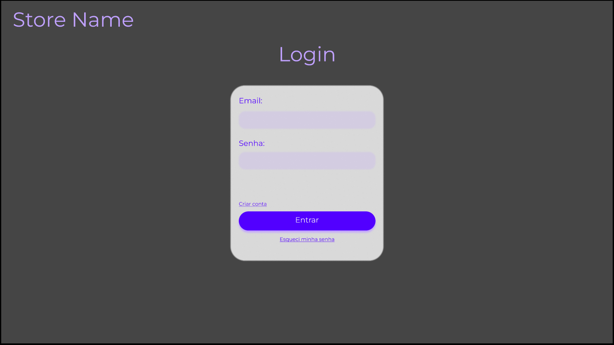
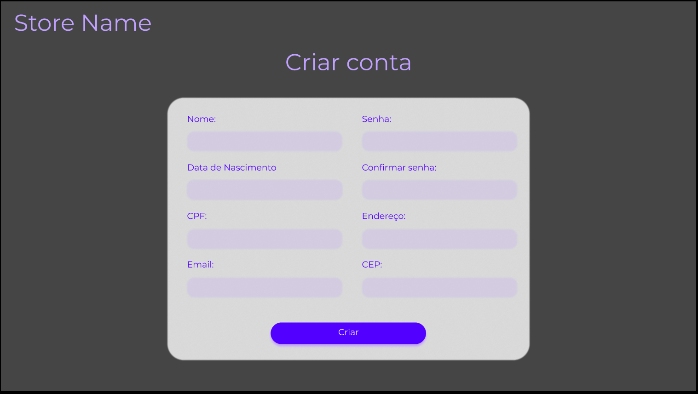
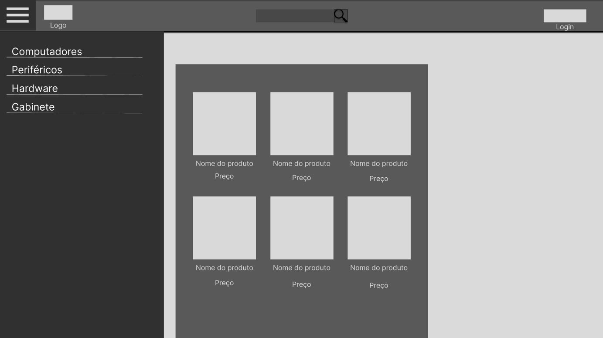

# ProjetoPI3° Semestre - Turma D
#### Projeto Integrador: Desenvolvimento de Sistemas Orientado a Objetos
Lista de Funcionalidades - E-Commerc de Informática
- Login ou cadastro
- Perfil
- Pagina administrativa
- Cadastro de produtos
- Página inicial
- banner
- Barra de pesquisa (?)
- filtro de categorias de produtos
- Pagina de produtos
- Carrinho de compras
- pagina de pagamento
- Historico de compras
- Página de Suporte ao Cliente

### Integrantes do Grupo
- João Vitor Estevam - GitHub estevam99
- Kayque Fernandes Melo - GitHub: kayqemelo
- Lucas de Jesus Silva - GitHub: LucasJesus17
- Lucas Ferreira Silva - GitHub: LucasLfs2004
- Wellington Alves - GitHub: WEALVES

# Diagrama Entidade Relacionamento

# Protótipos das páginas

### - Página de login

### - Página de criação de conta

### - Tela de cadastro de produtos

### - Página principal

### - Página de produtos

### - Carrinho de compras

### - Histórico de compras

### - Minha conta

### - Minha conta part II

## [Link dos protótipos no FIGMA](https://www.figma.com/file/QCVCo9zzUu166ASxhm5xYO/Login%2FCadastro%2FCadastroProdutos?node-id=0%3A1&t=YhoIPclcfKGg73mN-1)

# ADO Entrega para dia 09/04

### Para a realização da ado a tela selecionada para fazer a comunicação com o banco de dados foi a tela de cadastro de usuário

## Script do banco de dados: 

CREATE TABLE USUARIO(
  ID INT PRIMARY KEY AUTO_INCREMENT, 
  NAME VARCHAR(255),
  DATA_NASCIMENTO VARCHAR(10),
  CPF VARCHAR(15),
  EMAIL VARCHAR(70),
  SENHA VARCHAR(50),
  ENDERECO VARCHAR(100),
  CEP VARCHAR(9)
);

#### As outras telas ainda estão em construção, por isso a a única aparente no momento é a tela de cadastro de usuário.