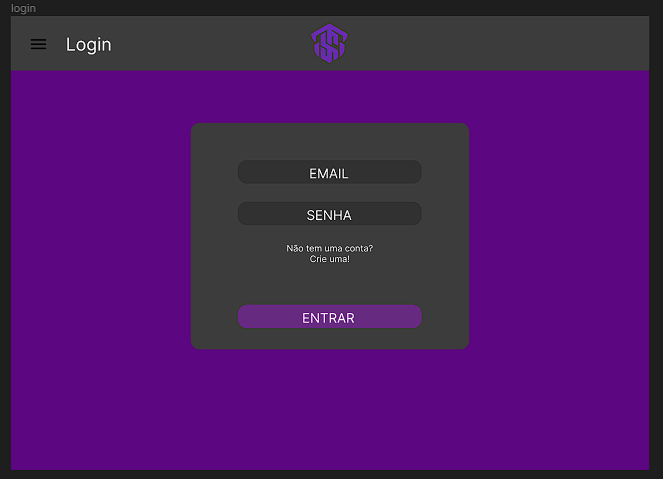
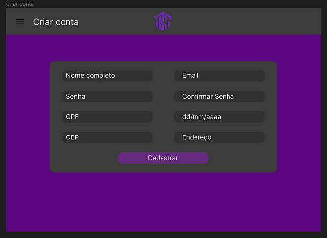
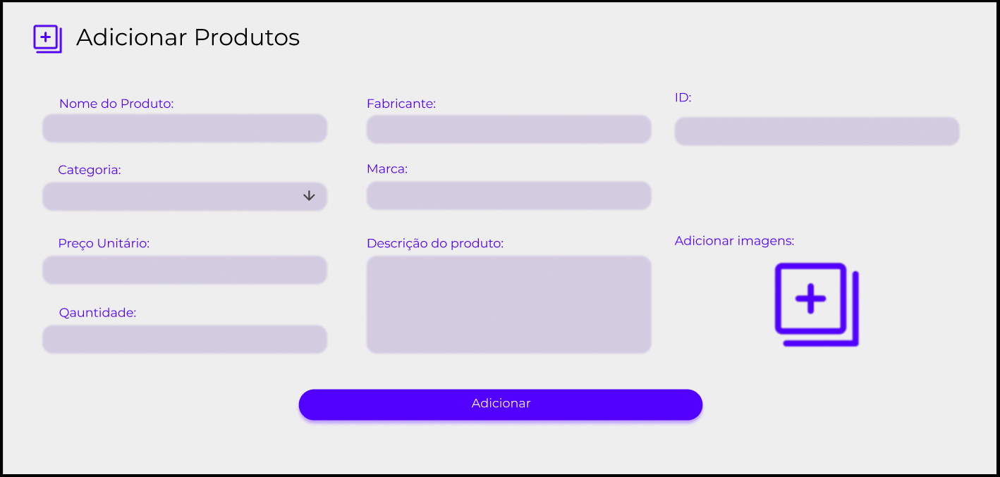
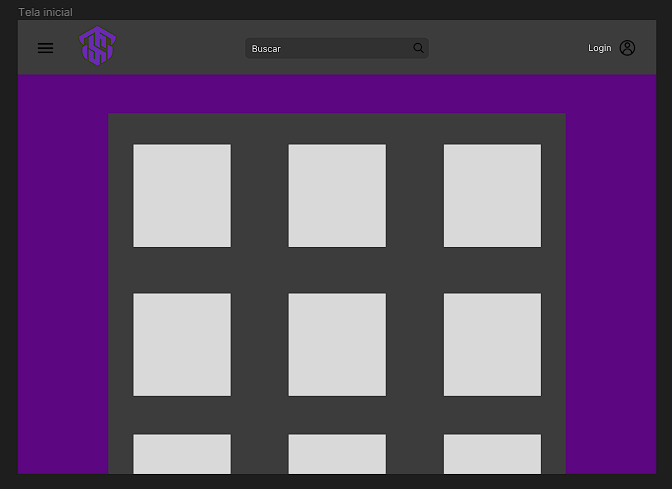
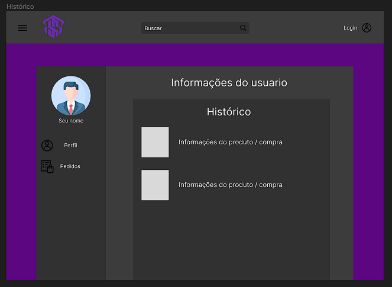
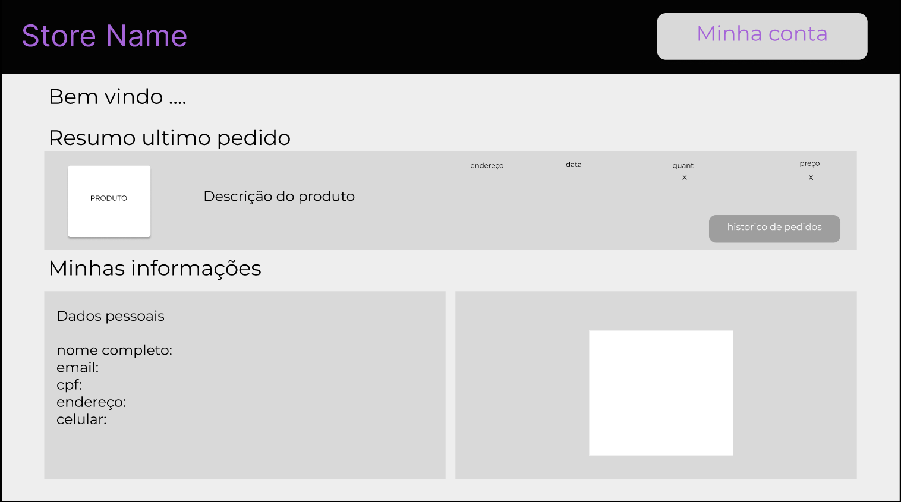
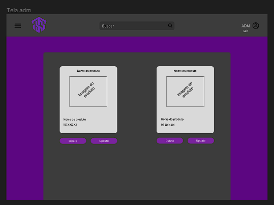

# ProjetoPI3° Semestre - Turma D
#### Projeto Integrador: Desenvolvimento de Sistemas Orientado a Objetos
Lista de Funcionalidades - E-Commerc de Informática
- Login ou cadastro
- Perfil
- Pagina administrativa
- Cadastro de produtos
- Página inicial
- banner
- Pagina de produtos
- Carrinho de compras
- pagina de pagamento
- Historico de compras
- Página de Suporte ao Cliente

### Integrantes do Grupo
- João Vitor Estevam - GitHub estevam99
- Kayque Fernandes Melo - GitHub: kayqemelo
- Lucas de Jesus Silva - GitHub: LucasJesus17
- Lucas Ferreira Silva - GitHub: LucasLfs2004
- Wellington Alves - GitHub: WEALVES

# Diagrama Entidade Relacionamento

# Protótipos das páginas

### - Página de login

### - Página de criação de conta

### - Tela de cadastro de produtos

### - Tela inicial

### - Carrinho de compras

### - Histórico de compras

### - Minha conta

### - Minha conta part II

### - Tela de adiministrador

# - Identidade visual
- Paleta de cores

- Logotipos:

 

- ## [Link arquivos identidade visual](https://encurtador.com.br/yz036)
- ## [Cores em HEXA](https://encurtador.com.br/cmzAE)

## Script do banco de dados: 

CREATE DATABASE TECHSTORE;

USE TECHSTORE;

CREATE TABLE USUARIO(
  ID INT NOT NULL AUTO_INCREMENT, 
  NAME VARCHAR(255) NOT NULL,
  DATA_NASCIMENTO VARCHAR(255) NOT NULL,
  CPF VARCHAR(15) UNIQUE,
  EMAIL VARCHAR(70) UNIQUE,
  SENHA VARCHAR(50) NOT NULL,
  ENDERECO VARCHAR(100) NOT NULL,
  CEP VARCHAR(9) NOT NULL,
  ADMIN VARCHAR(5),
  PRIMARY KEY(`ID`)
);

CREATE TABLE PRODUTO(
  ID_PRODUTO INT NOT NULL AUTO_INCREMENT,
  NOME_PRODUTO VARCHAR(60) NOT NULL,
  MARCA VARCHAR(30) NOT NULL,
  CATEGORIA VARCHAR(255) NOT NULL,
  PRECO DOUBLE NOT NULL,
  DESCRICAO VARCHAR(255),
  IMAGE VARCHAR(255) NOT NULL,
  QTD INT NOT NULL,
  PRIMARY KEY (`ID_PRODUTO`)
);

CREATE TABLE VENDA (
  ID_VENDA INT NOT NULL AUTO_INCREMENT,
  ID_CLIENTE INT NOT NULL,
  ID_PRODUTO INT NOT NULL,
  NOME_CLIENTE VARCHAR(40) NOT NULL,
  DATA_COMPRA VARCHAR(255) NOT NULL,
  QUANTIDADE_VENDIDA INT NOT NULL,
  VALOR_TOTAL DOUBLE NOT NULL,
  CEP_ENTREGA VARCHAR(15) NOT NULL,
  ENDERECO_ENTREGA VARCHAR(255) NOT NULL,
  PAGAMENTO VARCHAR(30) NOT NULL,
  PRIMARY KEY (ID_VENDA),
  FOREIGN KEY (ID_CLIENTE) REFERENCES USUARIO (ID),
  FOREIGN KEY (ID_PRODUTO) REFERENCES PRODUTO (ID_PRODUTO)
);
